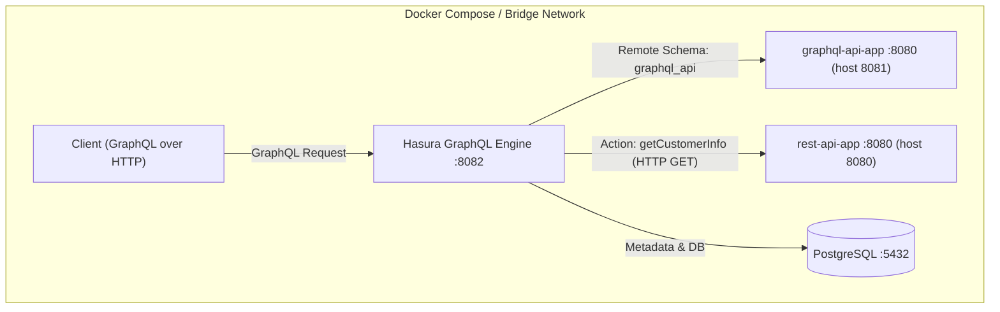

# GraphQL-Rest-For-Test-Hasura

This monorepo contains two web applications: a REST API app and a GraphQL app. Both are developed using Go.

This repository is designed for cases where the frontend communicates **only via GraphQL** while multiple backends exist (GraphQL service + REST service). By wiring the REST backend through Hasura Actions and the GraphQL backend through a Remote Schema, you can expose both through a single GraphQL surface **without rewriting the REST backend into GraphQL**.

## Architecture Overview


- Hasura auto-applies metadata and migrations at startup (cli-migrations image with mounted `hasura/metadata` and `hasura/migrations`).
- GraphQL app is registered as a Remote Schema: when a Hasura GraphQL query includes fields from `graphql_api`, Hasura proxies to `graphql-api-app:8080/graphql` inside the Docker network.
- REST app is registered via Hasura Actions: clients call the GraphQL action `getCustomerInfo`, and Hasura server-side calls `rest-api-app:8080/Customer/getCustomerInfo`.
- Field-level routing in Hasura:
  - DB-mapped fields → executed against Postgres
  - Remote Schema fields → proxied to `graphql-api-app`
  - Action fields → HTTP handler on `rest-api-app`

## GraphQL Security Hardening

Applied (supported in OSS version)
- Disable Hasura Console: `HASURA_GRAPHQL_ENABLE_CONSOLE=false`
- Enforce Allow List: `HASURA_GRAPHQL_ENABLE_ALLOWLIST=true` with permitted operations registered in metadata (`queryProducts`, `getCustomerInfo`).
- Disable introspection: `HASURA_GRAPHQL_ENABLE_INTROSPECTION=false`
- Add healthcheck: monitor Hasura service via `/healthz`.

Not applied in OSS (requires Cloud/Enterprise or infra changes)
- API limits (query depth/node/rate) are Cloud/Enterprise features and not configured here.
- Admin secret/JWT key are plain in docker-compose; in production, inject via env/secret manager.

Ops notes
- To add more allowed operations: update `hasura/metadata/query_collections.yaml` and `hasura/metadata/allow_list.yaml`, then `docker-compose up -d hasura --force-recreate` or `hasura metadata apply` (if CLI available).
- A metadata-autofix helper container runs after Hasura is healthy to reconcile metadata.

## Hasura Automation

- `metadata-autofix` service (defined in `docker-compose.yml`) starts after the Hasura health check passes and runs `replace_metadata` to restore missing Actions if any are detected.
  - Image: `hasura/scripts/Dockerfile.metadata-autofix` (Python 3.10 + curl + PyYAML preinstalled)
  - Script: `hasura/scripts/metadata-autofix.sh`
  - Environment: `HASURA_ENDPOINT` (default `http://hasura:8080`), `HASURA_ADMIN_SECRET` (default `admin-secret`)
  - Flow:
    1. Call `export_metadata` to fetch current metadata
    2. Auto-detect Action names from `actions.yaml` and check which are missing
    3. When missing Actions exist, run `replace_metadata` using local `hasura/metadata`, then re-check
    4. Log success/failure to stderr (payload/response stored as temp files)
  - Logs are written under `hasura/scripts` by default; override with `LOG_DIR` if needed.


## Combined Startup (Docker Compose)

Use Docker Compose to start both applications at the same time.

### Prerequisites

- Docker
- Docker Compose

### Startup Steps

1. Clone the repository.
2. Move to the project root directory.
3. Start all services with Docker Compose:
   ```
   docker-compose up -d
   ```

This starts the following services:

- **Hasura GraphQL Engine**: http://localhost:8082 (frontend communicates **only** with Hasura; backend services are reached via Hasura)
- **REST API App**: http://localhost:8080
- **GraphQL API App**: http://localhost:8081
- **PostgreSQL**: localhost:5432

### Stop services

```
docker-compose down
```

### View logs

```
# Logs for all services
docker-compose logs -f

# Logs for a specific service
docker-compose logs -f rest-api-app
docker-compose logs -f graphql-api-app
docker-compose logs -f hasura
```

For more information about the REST API app, please refer to `rest-api-app/README.md`. The GraphQL app has its own guide at `graphql-api-app/README.md`.